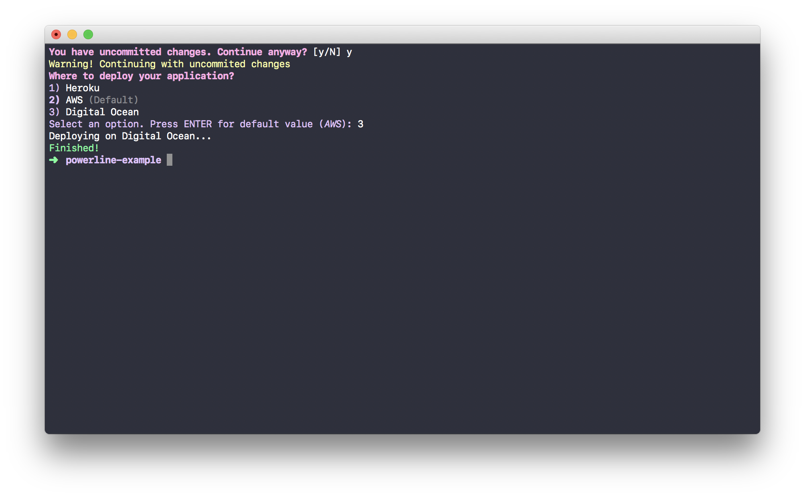

<p align="center">


</p>

# Powerline

Powerline is a library for writing solid command-line interfaces in Swift, for Linux and macOS.




## Features

- [x] Subcommands
- [x] Type-safe options parsing
- [x] String colouring 
- [x] Shell commands

## Glossary
* **Command**
   A command is a space-delimited string , where the first string component is the name of an executable.

* **Argument**
   An argument is a string component of a command.


* **Named argument**
   A named argument is a key-value argument written like this `--message Hello` or `-m Hello`.

* **Flag**
   A flag is a on-off switch which presence (or lack thereof) defines a condition. Flags can be written as such: `--verbose` or `-v`.

   * Multiple flags can be combined, so instead of writing `-a -b -c`, writing `-abc` works too.
   * A series of flags can contain a named argument last, e.g. `git commit -am "Changes"`.

* **Positional argument**
   A positional one or more values as a simple strings in a command.


## Usage
Creating structured commands with Powerline is easy. The best way to produce type-safe and clean code is to add arguments and commands via extensions.

Let's create a CLI that greets people.

### Create a new Swift executable

```sh
$ mkdir powerline-example
$ cd powerline-example
$ swift package init --type executable
```

In your `Package.swift` file, add `Powerline` as a dependency:

```swift
import PackageDescription

let package = Package(
    name: "powerline-example",
    dependencies: [
        .Package(url: "https://github.com/formbound/Powerline", majorVersion: 0, minor: 1)
    ]
)
```

#### Create flags, named arguments and positional arguments 

```swift
import Powerline

extension Flag {
    static let verbose = Flag(
        name: "verbose",
        character: "v",
        summary: "Prints debug output"
    )
}

extension NamedArgument {
    static let output = NamedArgument(
        name: "output",
        character: "o",
        summary: "File to write to",
        valuePlaceholder: "file"
    )
}

extension PositionalArgument {
    static let names = PositionalArgument(
        name: "names",
        summary: "Names to greet",
        variadic: true
    )
}
```

#### Create commands

Create the command in an extension, or store in any other way of your preference. 

```swift
extension Command {
    static let greeter = Command(
        name: "greeter",
        summary: "Greets people",
        subcommands: [],
        positionalArgument: .names,
        namedArguments: [.output],
        flags: [.verbose]) { result in

        // Check flags
        let verbose: Bool = result.flags.contains(.verbose)

        if verbose {
            result.stdout("Verbose mode enabled")
        }

        var resultString: String = ""

        // Loop through positional arguments
        for name in result.positionalArguments {
            resultString += "Hello " + name + "!\n"
        }

        // Get value from named argument
        if let outputFile: String = try result.value(for: .output) {
            try resultString.write(toFile: outputFile, atomically: true, encoding: .utf8)
        }
        else {
            // Print greetings
            result.stdout(resultString)
        }
    }
}
```


The signature for a command handler closure is `(Command.Result) throws -> Void`, so you could just as easily put the handler function somewhere else.

```swift
let command = Command(
    name: "example",
    summary: "Example command",
    handler: exampleCommandHandler
)

func exampleCommandHandler(handler: Command.Result) throws {
    // Handle command
}
```

#### Run a command

In your `main.swift` file, simply add

```swift
Command.greeter.runOrExit()
```

You can also handle errors yourself, by running

```Swift
do {
  try Command.greeter.run()
} catch {
  print("\(error)")
}
```

#### Throwing errors

You can throw any error you want, and handle them as you wish. When running commands using `runOrExit()` , throwing a `CommandError` will output the message you provide to `stderr`.

```swift
throw CommandError("Invalid usage")
```

Build your executable

```swift
$ swift build
```

Run the executable

```swift
$ .build/debug/powerline-example --help
```

Here's the output you'll see:


The command is now ready to use! 👾

## Additionally

### Printing to stdout and stderr

```swift
func commandHandler(result: Command.Result) throws {
    // Print to stdout
    result.stdout("Hello")
    // Print to stderr
    result.stderr("Hello")
}
```

### Running shell commands

A shell command will throw an error if it exists with a non-zero value.

```swift
func commandHandler(result: Command.Result) throws {
	
    // Run a command synchronously
    let shellResult = try result.cmd("ls -a1")
    print(shellResult.standardOutput) // Optional
    print(shellResult.standardError)  // Optional
    
    // Run a command asynchronously
    let process = try result.cmd("ls -a1") { error, result in
        // Run asynchronously
    }

    process.suspend()
    process.resume()
}
```

### Prompting

You can read from `stdin` in a few useful ways:

```swift
func commandHandler(result: Command.Result) throws {

    if let input = result.readInput() {
        // Do something with input
    }

    if result.confirm("Are you sure?") {
        // User is sure
    }

    let options = ["One", "Two", "Three", "Four"]

    // `default` is optional, forcing the user to make an active choice
    let selectedOption = result.select(
        options,
        default: options[1],
        message: "Where to deploy your application?"
    )
}
```

## Credits

- David Ask ([@davidask](https://github.com/davidask))

## License

Pin is released under the MIT license. See LICENSE for details.

## About Formbound

[Formbound AB](https://github.com/formbound) is a software development firm devoted to open-source development.
